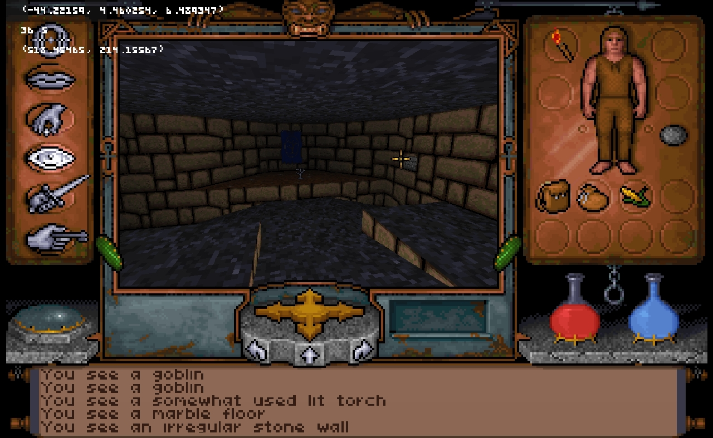
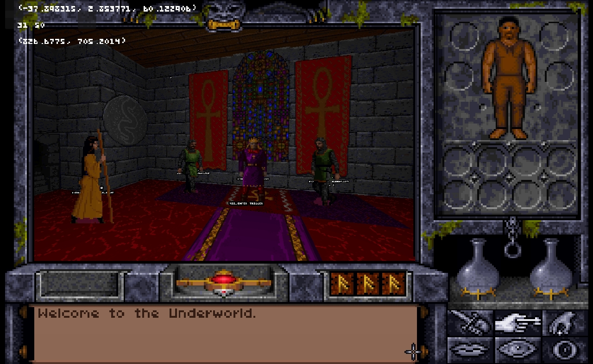

# UnderworldGodot

- [UnderworldGodot](#underworldgodot)
  - [Overview](#overview)
  - [Credits](#credits)
  - [Before you begin.](#before-you-begin)
  - [Current features](#current-features)
  - [Whats missing](#whats-missing)
  - [Getting Started](#getting-started)
  - [UWsettings.json](#uwsettingsjson)
  - [Controls](#controls)
- [Appendix](#appendix)
  - [Guide to the Underworld and Reverse Engineering](#guide-to-the-underworld-and-reverse-engineering)
  - [Sources/Previous Projects](#sourcesprevious-projects)
    - [Sources (taken from my Guide to the Underworlds)](#sources-taken-from-my-guide-to-the-underworlds)
      - [Also referenced](#also-referenced)
      - [Credits](#credits-1)
        - [Credits from the Abysmal Project](#credits-from-the-abysmal-project)
        - [Credits from the Underworld Adventures Project](#credits-from-the-underworld-adventures-project)
        - [Other contributions to this document](#other-contributions-to-this-document)

## Overview
An engine recreation of Ultima Underworld and Ultima Underworld 2 in the Godot Engine.

This project supercedes the Unity-based project and reboots the code base to act more like the Underworld games originally worked.




## Credits
This project is largely based on the previous reverse engineering work undertaken by various groups and individuals over the years. Without their efforts this project would not be possible please see the appendix below for the credits I have been able to attribute. If I have failed to give proper credit please let me know and I will happily correct this document.

## Before you begin.
This is currently pre-alpha. No support is provided for it and usage is at your own risk. Please don't download this version and expect it to be usable in anyway.

Requires game files for either UW1 or UW2. GOG versions need to be extracted using a zip extracter from the game.gog file


## Current features
* Map loading
* Animated doors and sprites
* Looping NPC animations
* Partial Conversations
* Barter logic (excluding actual exchange of items)
* Lighing effects
* Basic inventory management including runebag
* Picking up and dropping of items (without checking pickup rules)
* Usable switches
* Reading signs
* Game strings
* Palette cycling and shading
* Save file loading
* Player stats display
* HP and Mana Displays
* Compass status message
* 3D Models
* Food consumption
* Spell casting (partial) and vanilla decoding of object enchantment values into actual spell effects
* Small window cutscenes


## Whats missing
* Player collision and regular movement
* Object physics
* NPC AI, movement and pathfinding
* Sound and music
* Combat
* Sleeping
* Plot events
* Plot variables, and quest variables (outside of conversations)
* Cutscenes
* Options menu
* Many traps and triggers
* Transparencies
* Saving  
* Level transitions
* Character creation
* and much more!

## Getting Started

No exe builds yet. This is just a glorified map viewer at this point that you will need to build in Godot yourself.

See [https://godotengine.org/](https://godotengine.org/) for engine runtime downloads.

1. Clone the repository
2. Install the Godot engine dev  https://godotengine.org/ and run it.
3. Save a file called ``uwsettings.json`` in the Godot Folder. See below for format of the file
4. Open the Project scene file ``Underworld.tscn`` in Godot.
5. Run. It might work

This project is developed using VSCode using the C# Tools for Godot extensions.

## UWsettings.json

Enter optional paths for each game. Select the folder with the .exe file.
If using the gog versions extract the file ``game.gog`` using a tool like 7-zip and point to that folder.

To select maps to load.
1. Choose the game mode by editing the gametoload param in the file ``uwsettings.json``. This file should be located in the same path as Godot or a built exe.
   1.  UW1 or UW2 are the valid values.
2. Enter the level number. Values start at 0.
3. Other values
   1. Light level- Shading in a range 0-7. Value is ignored
   2. levarkfolder - Change from ``DATA`` to ``SAVE1`` to ``SAVE4`` to load savegames.
   3. Shader - Default shader used. Value is ignored

```json
{
    "pathuw1": "C:\\Games\\UW1\\game\\UW",
    "pathuw2": "C:\\Games\\UW2IDA\\UW2",
    "gametoload": "UW2",
    "level": 0,
    "lightlevel" : 7,
    "levarkfolder" : "DATA",
    "shader" : "UWSHADER"
}
```


## Controls
Camera is only in fly mode currently.

WSAD for movement.
T to toggle mouse look

Use shift and scroll to change speed.


# Appendix
## Guide to the Underworld and Reverse Engineering
See  [https://github.com/hankmorgan/UWReverseEngineering] for my dissassemblies and notes on UW1/UW2

## Sources/Previous Projects

### Sources (taken from my Guide to the Underworlds)
The information in this document is gathered from a number of sources most notably the vernable uw-formats.txt. Sections of this document if not taken directly from UW-Formats.txt are heavily based on the work that has gone into that document by a number of contributors and groups over the years. Every effort is being made to list this contributions here. To avoid missing anyone I am quoting verbatim the credit section of each copy of uw-formats.txt I can referencing.

Unfortunately some information sources have been lost to me over time. If I have missed a reference or not given due credit for research or code examples then please let me know and I will happily correct the record.

#### Also referenced

Unknown authors [Internal Formats on the Ultima Codex](https://wiki.ultimacodex.com/wiki/Ultima_Underworld_internal_formats) 

Mitch Aigner FAQs for [UW1](https://gamefaqs.gamespot.com/pc/562665-ultima-underworld-the-stygian-abyss/faqs/1811) abd [UW2](https://gamefaqs.gamespot.com/pc/564592-ultima-underworld-ii-labyrinth-of-worlds/faqs/1813)

#### Credits
The following credits are taken verbatim from the files shared by named projects.

The "me" mentioned in the credits is not the author of this guide.

##### Credits from the Abysmal Project
   My thanks go out to Jim Cameron that started the original "uw-specs.txt"
   file and subsequently found out more unknown data structures and discussed
   about file formats with me. Many thanks, Jim!

   Additional information came from
   Alistair Brown (basic object format, via the Underworld II editor available at
   <http://bearcity.pwp.blueyonder.co.uk/>)
   Ulf Wohlers (Objects and 3D models).
   Fabian Pache (about map details and 3d models, ``UW2`` conversations
   ``UW2`` player save <http://uw2rev.sourceforge.net>).

   Further infos about weapon animation and miscellaneous bits about uw were
   contributed by Telemachos from peroxide.dk.

   I also like to thank Telemachos who pointed me to the TSSHP's file formats
   file at the start of all of this.

   This file is probably:
   Copyright (c) 2008,2009 Julien Langer
   Copyright (c) 2002,2008,2009 Fabian Pache
   Copyright (c) 2000,2001,2002,2003 Jim Cameron
   Copyright (c) 2002,2003,2004 Michael Fink
   Copyright (c) 2004 Kasper Fauerby

##### Credits from the Underworld Adventures Project
   My thanks go out to Jim Cameron that started the original "uw-specs.txt"
   file and subsequently found out more unknown data structures and discussed
   about file formats with me. Many thanks, Jim!

   Additional information came from Alistair Brown (basic object format, via
   the Underworld II editor available at
   <http://bearcity.pwp.blueyonder.co.uk/>), Ulf Wohlers (Objects and 3D
   models) and Fabian Pache (about map details and 3d models, ``UW2`` related,
   http://uw2rev.sourceforge.net).

   Further infos about weapon animation and miscellaneous bits about uw were
   contributed by Telemachos from peroxide.dk.

   I also like to thank Telemachos who pointed me to the TSSHP's file formats
   file at the start of all of this.

   This file is probably:
   Copyright (c) 2000,2001,2002,2003 Jim Cameron
   Copyright (c) 2002,2003,2004 Michael Fink
   Copyright (c) 2004 Kasper Fauerby

##### Other contributions to this document
[KarlClinckspoor](https://github.com/KarlClinckspoor) on ``cmb.dat``